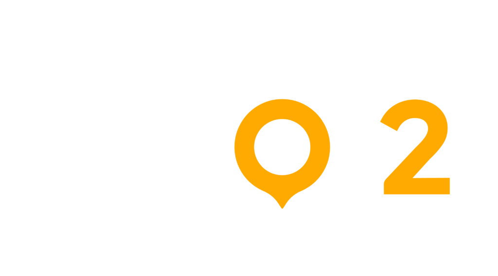

<p align="center"><a href="https://spot2.mx/" target="_blank"></a></p>

<p align="center">
<a href="https://github.com/laravel/framework/actions"></a>
<a href="https://packagist.org/packages/laravel/framework"></a>
<a href="https://packagist.org/packages/laravel/framework"></a>
<a href="https://packagist.org/packages/laravel/framework"></a>
</p>

## About Url Shortener

Url Shortener is a technical challenge designed by Spot2 to test the knowledge of full-stack developer candidates in their first stage.

## Requirements

- [Laravel 11](https://laravel.com/docs/11.x/installation).
- [PHP 8.3](https://www.php.net/releases/8.3/en.php).
- [Inertia - React](https://inertiajs.com/routing).
- [Composer](https://getcomposer.org/download).
- [Node Js](https://nodejs.org/en/download/package-manager).
- [Mysql](https://www.mysql.com).
- [Redis](https://redis.io/docs/latest).

## Installation

Before you start make sure you have composer installed on your system, as well as Node Js, and a Redis server and Mysql server running.

Also, in php have extensions enabled:
```sh
extension=php_redis.dll
extension=pdo_sqlite
extension=sqlite3
```


Clone the repository locally:

```sh
git clone https://github.com/dev-yohannylugo/url-shortener-spot2.git
cd url-shortener-spot2
```

Install PHP dependencies:

```sh
composer install
```
Install NPM dependencies:

```sh
npm install
```

Build assets:

```sh
npm run dev
```

Setup configuration:

```sh
cp .env.example .env
```

Generate application key:

```sh
php artisan key:generate
```
Create an MySQL database. You can also use another database (SQLite, Postgres), simply update your configuration accordingly.

```sh
CREATE DATABASE url_shortener_spot2;
```

Run database migrations:

```sh
php artisan migrate
```

Run database seeder:

```sh
php artisan db:seed
```

Run artisan server:

```sh
php artisan serve
```

You're ready to go! [Url Shortener](http://127.0.0.1:8000/) in your browser, and login with:

- **Username:** admin@spot2.com
- **Password:** Spot2Pass

## Running tests

To run the Ping CRM tests, run:

```
php artisan test
```

## License

The Url Shortener is open-sourced software licensed under the [MIT license](https://opensource.org/licenses/MIT).
